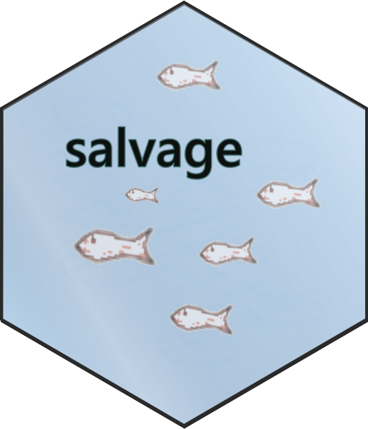

# [salvage.fish](https://www.salvage.fish)

Tools for smooth interactions with the [California Delta](https://en.wikipedia.org/wiki/Sacramento%E2%80%93San_Joaquin_River_Delta) [fish salvage monitoring database](https://wildlife.ca.gov/Conservation/Delta/Salvage-Monitoring).

## Data Accessability  

One present focus is reliably generating data products that are more broadly accessible. 

Each day, the [`/data` directory](https://github.com/dapperstats/salvage/blob/master/data) is populated with `.csv`s from an up-to-date "current" (1993 - Present) salvage database file (`Salvage_data_FTP.accdb`).

Updates are executed via [`cron` jobs](https://docs.travis-ci.com/user/cron-jobs/) on [`travis-ci`](https://travis-ci.org/dapperstats/salvage) using the `accessor` [`Docker`](https://www.docker.com) [software container](https://www.docker.com/resources/what-container).
Code for the construction of the [`accessor` image](https://hub.docker.com/r/dapperstats/accessor) is available in a [separate repo](https://www.github.com/dapperstats/accessor).
 
Read more details on the [methods](https://github.com/dapperstats/salvage/blob/master/documents/methods.md), including how to run your own data [conversions](https://github.com/dapperstats/salvage/blob/master/documents/conversion.md).

## Authors

[**J. L. Simonis**](https://orcid.org/0000-0001-9798-0460) of [DAPPER Stats](https://www.dapperstats.com)

If you are interested in contributing, see the [Contributor Guidelines](https://github.com/dapperstats/salvage/blob/master/CONTRIBUTING.md) and [Code of Conduct](https://github.com/dapperstats/salvage/blob/master/CODE_OF_CONDUCT.md).
