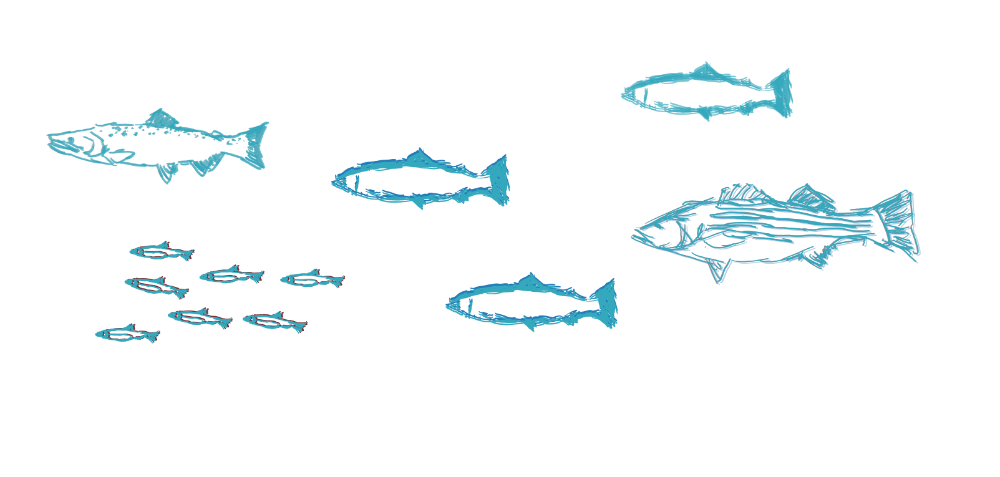

 

Welcome to the website for analyses of the [California Delta](https://en.wikipedia.org/wiki/Sacramento%E2%80%93San_Joaquin_River_Delta) [fish salvage database](https://wildlife.ca.gov/Conservation/Delta/Salvage-Monitoring), coded by [DAPPER Stats](https://www.dapperstats.com).

 

Source code is available on [GitHub](https://www.github.com/dapperstats/salvage).

Up-to-date `.csv`s of the salvage database files are available in the [salvage GitHub repository](https://github.com/dapperstats/salvage/tree/master/data/Salvage_data_FTP).

 

The site is currently **under construction**, so check back for updates!

