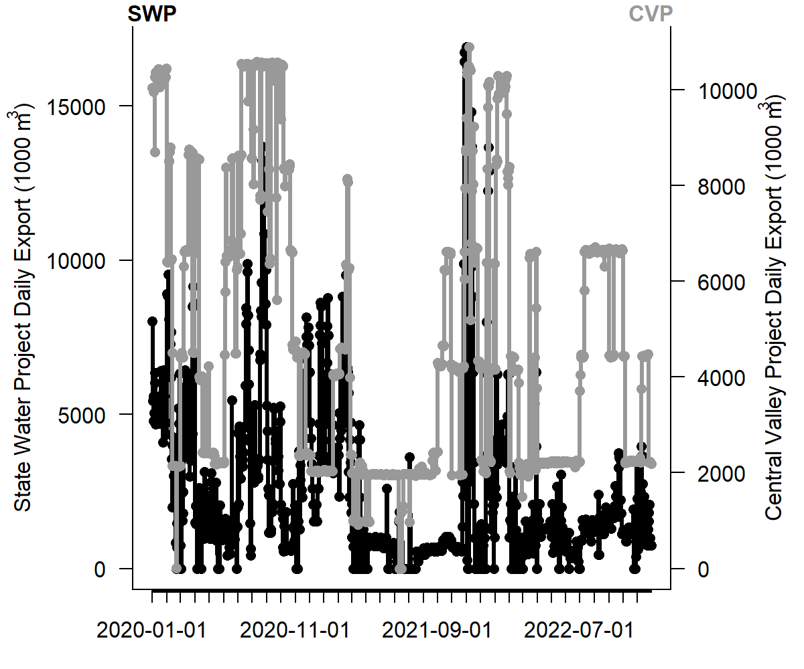

This page is minimal, but highlights the continuous integration (the data pulled from the FTP are used to update the **bolded** date below).

Come back for updates soon!


```{r, include = FALSE}

most_recent <- read.csv("files/most_recent_samples.csv", stringsAsFactors = FALSE)
sample_dates <- unique(as.character(c(most_recent$SWP, most_recent$CVP)))
n_sample_dates <- length(sample_dates)
if(n_sample_dates == 2){
  sample_dates <- c(most_recent$SWP, most_recent$CVP)
  date_txt <- paste0(sample_dates[1], " and ", sample_dates[2], " respectively")
} else if(n_sample_dates == 1){
  date_txt <- sample_dates
}

sample_vols <- read.csv("files/sample_vols.csv", stringsAsFactors = FALSE)
print(sample_vols)
file.exists("files/exported_volumes.png")
```




The most recent salvage samples posted to the FTP from the State Water Project and Central Valley Project were collected on **`r date_txt`**. 

`.csv`s of the Salvage database files are available in the [salvage GitHub repository](https://github.com/dapperstats/salvage/tree/master/data/Salvage_data_FTP).
```